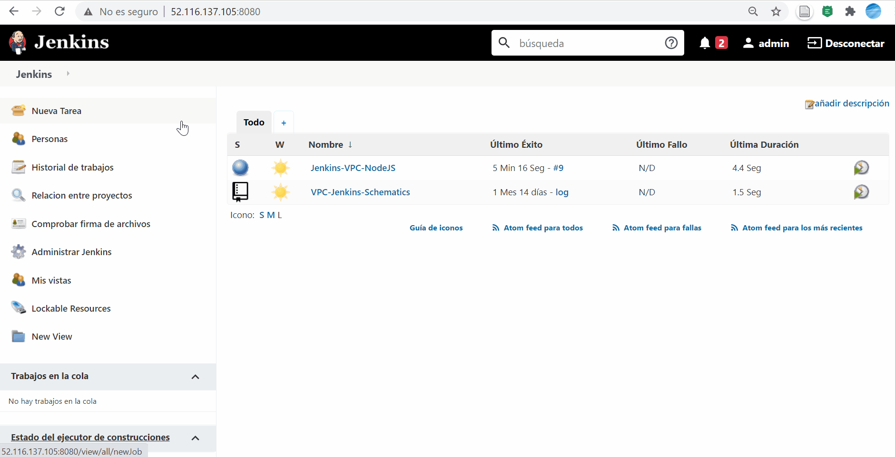
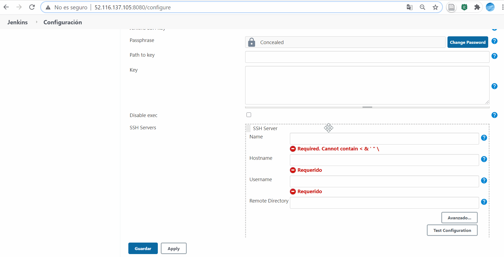
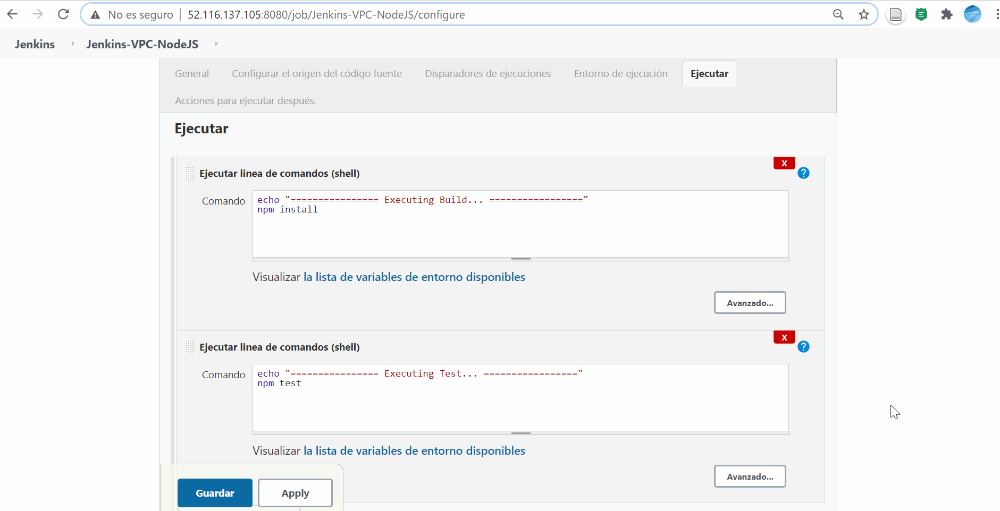
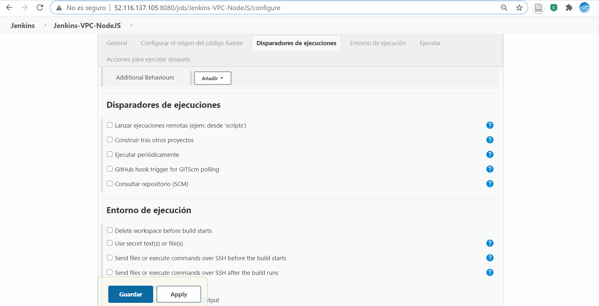
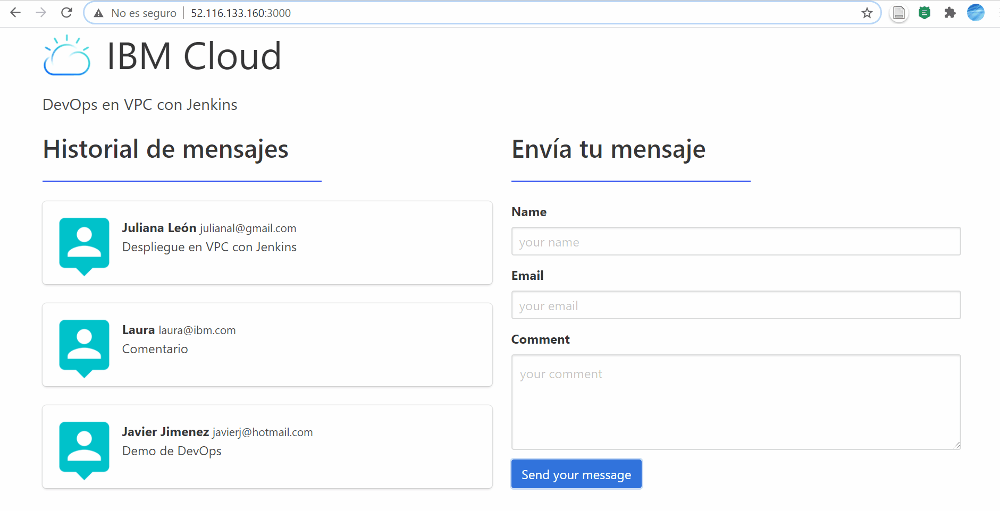

# DevOps con Jenkins en VPC

En esta guía encontrará el paso a paso para el despliegue de una aplicación NodeJS en una VSI en VPC dentro de IBM Cloud, haciendo uso de Jenkins como servidor de integración continua.

<p align="center">
  
</p>

### Contenido 

1. [Pre-requisitos](#Pre-requisitos-)
2. [Creación del proyecto en Jenkins](#creación-del-proyecto-en-jenkins-)
3. [Configuración de la comunicación SSH (Pluguin de SSH)](#configuración-de-la-comunicación-ssh-)
4. [Despliegue del pipeline](#despliegue-)
5. [Configuración del Webhook](#configuración-del-webhook-octocat)
6. [Referencias](#referencias-)

## Pre-requisitos 

1. Tener una cuenta en IBM Cloud.

2. Contar con una cuenta en GitHub.

3. Contar con una VPC y 2 Virtual Servers for VPC. [Consulte cómo crear VSI for VPC](https://cloud.ibm.com/docs/vpc-on-classic-vsi?topic=vpc-on-classic-vsi-virtual-private-cloud&locale=es).

4. Instalar Jenkins en una de las VSI. [Consulte cómo instalar Jenkins](https://www.digitalocean.com/community/tutorials/how-to-install-jenkins-on-ubuntu-18-04-es#:~:text=Paso%201%3A%20Instalar%20Jenkins,-La%20versi%C3%B3n%20de&text=Primero%2C%20agregue%20la%20clave%20del,de%20Debian%20a%20la%20sources.).

5. Instalar npm en ambas VSI. [Consulte cómo instalar NodeJS](https://nodesource.com/blog/installing-node-js-tutorial-debian-linux/) ó [Cómo instalar npm](https://www.digitalocean.com/community/tutorials/como-instalar-node-js-en-ubuntu-18-04-es).


## Creación del proyecto en Jenkins 📄

1. Dentro de la interfaz de Jenkins haga clic sobre la pestaña **"Nueva tarea"** .
2. Llene los parámetros solicitados, para este caso solo debe ingresar el nombre que le desea asignar.
3. Seleccione **"Crear un proyecto de estilo libre"** y a continuación haga clic en el botón **"OK"**.
4. Ahora en el apartado de **"Configurar el origen del código fuente"** seleccione la opción de **"git"**.
5. Una vez marcada la opción de **"git"** nos aparecera un pequeño menú de configuración, especifique la URL del repositorio en donde esta alojada la aplicación.
6. Agregue las credenciales para acceder a GitHub y guarde los cambios.

<p align="center">
  
</p>

## Configuración de la comunicación SSH 🔑

### Instalar plugin "Publish Over SSH" en Jenkins
1.  Dentro de la interfaz de Jenkins deberá dirigirse a la pestaña **"Administrar Jenkins"** y luego hacer clic en **"Administras plugins"**.
2.  Hacer clic en la pestaña **"Todos los plugins"**, luego busque el plugin _**Publish Over SSH**_ seleccionelo y de clic en el botón **instalar sin reiniciar**.

### Configuración del plugin Publish Over SSH 

1. Cree las claves SSH para la conexión, para esto, en el servidor donde desplegará la aplicación, ejecute el comando que se muestra a continuación y no ingrese ningún valor en las opciones pedidas en consola.

```sh
ssh-keygen
```

2. El comando anterior le dará la ruta donde se guardan los archivos id_rsa.pub y id_rsa. Copie el contenido del archivo id_rsa.pub en el archivo authorized_keys que se encuentra dentro de la misma ruta.

3. Copie los 3 archivos mencionados en el paso 2 en el servidor de Jenkins en la ruta:  /usr/share/jenkins/.ssh

4.  Dentro de la interfaz de Jenkins deberá dirigirse a la pestaña **"Administrar Jenkins"** y luego hacer clic en **"Configuración del sistema"**.

5.  En el apartado **"Publish over SSH"** llene los diferentes parámetros que se requieren.

*   Passphrase: La frase de contraseña de la clave privada. Déjelo en blanco si la clave no está encriptada.
*   Path to key: La ruta a la clave privada. Proporcione la ruta al archivo que contiene la clave o pegue la clave en el cuadro "key". 
*   Key: Pegue la clave privada aquí o proporcione la ruta al archivo que contiene la clave Path to key.
*   Name: Cualquier nombre para diferenciar la conexión.
*   Hostname: IP del servidor.
*   Username: Usuario del servidor.
*   Remote directory: Cualquier directorio en el servidor.

6. Realice una prueba de la conexión en el boton **"Test configuration"**.

Puede guiarse del siguiente gif para los valores que deben ingresarse en los pasos anteriores.

<p align="center">
  
</p>
   
## Despliegue 🚀

1. Dentro de su tarea de Jenkins ingrese en la pestaña **"Configurar"** y luego vaya a la sección **"Ejecutar"**.
2. De clic en **"Añadir un nuevo paso"**, seleccione **"Ejecutar en la linea de comandos (shell)"**, e ingrese el siguiente fragmento de código.

```sh
echo "================ Executing Build ================="
npm install
```

3. Repita el paso anterior e ingrese el siguiente código.

```sh   
echo "================ Executing Test ================="
npm test
```

4. Seleccione la pestaña **"Acciones para ejecutar después"** para configurar el manejo que se le dará al artefacto (paquete) resultante de la fase anterior. Ingrese los siguientes datos:

* Ficheros para guardar: Ubicación donde se va a guardar el artefacto. 
* Name: nombre de identificación colocado en la configuración del plugin de SSH.
* Source files: se definen los archivos que queremos llevar a nuestro servidor de producción. 
* Remove prefix: si se quiere remover los prefijos de la ruta de nuestro artefacto. 
* Remote directory: carpeta remota en la que se guardarán los archivos.
* Exec command: comando de despliegue, este se ejecuta en la máquina de producción desde la carpeta /home, se pueden utilizar variables de entorno.
 
 Para la guía puede tomar el siguiente fragmento de código para el valor del parámetro **"Exec comand"**.
 
 ```sh 
  cd /prod/
  nohup node ./bin/www >> output.log 2>&1 &
```
Puede usar los valores mostrados en el siguiente gif para los demás parámetros.

<p align="center">
  
</p>
  
  ## Configuración del webhook :octocat: 
  
Los webhooks de GitHub en Jenkins se usan para activar la compilación cada vez que un desarrollador confirma una acción a la rama maestra. En esta guía se hace la configuración para activar la compilación cuando se realiza un push dentro del respositorio, mediante los siguientes pasos:

1. Dentro de GitHub diríjase al repositorio de su proyecto.
2. Seleccione **"Configuración"** en la esquina derecha, luego haga clic
en **"webhooks"** y pulse **"Agregar webhooks"**.
3. Ingrese los siguientes datos:

* Payload URL: La URL del servidor que recibirá las solicitudes de webhook. Tome la IP del servidor de Jenkins y agregue al final /github-webhook/.
* Content type: El tipo de contenido. 
* Secret: Establecer un secreto de webhook le permite asegurarse de que las solicitudes enviadas sean de GitHub.

Tome el siguiente Gif como guía de los valores a ingresar.

<p align="center">
  
</p>

4. Dentro de su tarea de Jenkins ingrese en la pestaña **"Configurar"** y luego vaya a la sección **"Disparadores de ejecuciones"**. Finalmente active la opción **"GitHub hook trigger for GITScm polling"** y guarde los cambios.

Para probar las configuraciones anteriores puede hacer una modificación a su código y verá la creación de en nuevo pipeline dentro de Jenkins, recargue la página de la aplicación y verifique los cambios.

<p align="center">
  
</p>

## Referencias 🔎

Encuentre más información sobre [configuracíón de VPC dentro de IBM Cloud](https://cloud.ibm.com/docs/vpc/vpc-getting-started-with-ibm-cloud-virtual-private-cloud-infrastructure)

Encuentre más información sobre [configuracíón de pipelines en Jenkins](https://www.jenkins.io/)

## Autores ✒️

Equipo IBM Cloud Tech Sales Colombia.
